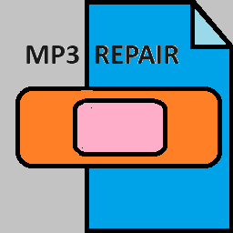

# **mp3repair**



## A brief history

The last time I bought a new car, I discovered that, with few exceptions, new cars no longer _have_ CD players - not
even as an option. My car has AM/FM and satellite radio, bluetooth, and a USB port.

If I wanted to listen to CDs on the road, there were two choices:

- find a CD player that would work with bluetooth or USB
- rip the CDs and copy the audio files to a USB stick.

I looked online for a suitable portable CD player but did not find a single one that promised to be fit for purpose
(typically, the listings included comments suggesting that the player _might_ work with my car's audio system, with no
guarantees at all). Buying a player was a crap shoot, and I'm weary of such adventures, so ripping CDs seemed the best
option for me.

I picked a few CDs, ripped them (using the Windows legacy MP3 player), copied the resulting files to a USB stick, and
tried playing them in the car. The results were **_disappointing_**. The audio quality was good enough, but the audio
system played tracks out of sequence, played tracks from different CDs as if they were on the same CD, and the artist
names it displayed were not what I expected.

### So what went wrong?

It all comes down to **metadata** (which is distinct from the encoded audio). When audio CDs are ripped, the ripping
software accesses one of several online databases, using the number of tracks and the lengths of the tracks as a key
for the search. If the search is successful, the database returns information for each track on the CD: the name of the
recording artist, the name of the album, the name of the track, and much more. That data is used to name the artist and
album directories and the audio files. It is also copied into the afore-mentioned metadata, which is written into each
audio file along with the encoded audio content.

In an ideal world, the information in those databases would come from the CD publishers. This is not that world; the 
data is, instead, crowdsourced. And, as with so much crowdsourced data, errors creep in. I have seen:

* Tracks seemingly randomly named (only once!)
* CDs in which most of the tracks are associated with the same album, but one or two are associated with a different 
album altogether
* CDs by the same artist, but whose database entries include a number of variations of the artist names

One might imagine that such problems could be fixed by:

* Renaming the misnamed tracks
* Gathering the separated tracks back into a common album directory
* Gathering the album subdirectories into a single correctly named artist directory

But it's not that simple.

**_The software that plays the audio files pays no attention to file names._** Its concept of artist/album/track is
governed by the metadata that's written into each audio file. No matter how we rename and rearrange the files, the
player will continue to play them in the sequence dictated by their metadata.

CD ripping software will let you edit the data it retrieves before ripping the CD (it has to, in order to handle search
misses, such as when the CD is not found in the database, or the database server is offline) and sometimes it may allow
edits _after_ ripping the CD; it's a tedious manual operation either way. When your CD collection numbers in the
hundreds or thousands, editing each audio file by hand is a daunting task.

As a retired software engineer, I determined that this was a job for ... a computer! I should be able to write a
program to automate the work of rewriting the metadata so that players would understand the artist:album:track
relationships. That was the beginning of the **mp3repair** program.

## What can **mp3repair** do?

The **mp3repair** program can detect three kinds of problems:

1. Metadata problems - the root cause of the problems described above.
2. Missing or duplicated track numbers - sometimes the ripping software misses a track, or you might have inadvertently 
marked a track to be skipped. Oops! A much less likely event is duplicated track numbers, where, for example, you might
have two 'track 3's. I'm not sure how that could happen, but it would probably require ripping the same CD with two 
different ripping programs.
3. Empty artist and album directories - these are really distractions for users, not generally something that causes a
problem.

The **mp3repair** program can fix the metadata problems. To fix missing tracks, you probably need to re-rip the CD. To
fix duplicate tracks, you probably need to just delete one of them. As for empty artist and album directories, you can
ignore them or delete them - your choice.

And in case this isn't obvious from the name: **mp3repair** only works on **mp3** audio files. There are many other
audio file formats; mp3 is what I use, and **mp3repair** only knows how to read and write mp3
[ID3V1](https://id3.org/ID3v1) and [ID3V2](https://id3.org/id3v2.3.0) metadata. This works very well for me: the mp3
format is strongly supported, and the mp3 playing software on my computer and the car's audio system understand the
ID3V1 and ID3V2 metadata, and my internet searches have assured me that those two, particularly ID3V2, are the industry
standard.

## How do I use mp3repair?

**_mp3repair_** is a command line tool - it has no fancy user interface, no windows, sorry. It is compiled as a
Windows 11 executable; it might run on Windows 10, but I have no way to tell.

So, the executable file, **mp3repair.exe**, needs to be (pick one):

*    placed in a directory in your computer's PATH.
*    placed in some other directory, and PATH edited to include that directory.
*    placed in a directory that you'll remember, and **_mp3repair_** is run from that directory like this:
**.\mp3repair.exe**

### Commands

On the command line, mp3repair is followed by one of the following commands, and then followed by command line flags 
and parameters specific to that command.

Here are the current commands and what they do:

1. **about** - this is a diagnostic tool; if the program misbehaves, the output from **about** may be helpful in
diagnosing the issue.
2. **check** - this is the command that determines whether there are problems with your mp3 files.
3. **export** - this command allows you to create a file that contains the default settings for **mp3repair** commands.
You can then edit this file to change **mp3repair**'s behavior.
4. **list** - this command allows you to list your mp3 files.
5. **postRepair** - this command cleans up temporary files created by running the **repair** command.
6. **repair** - this command rewrites the audio files that have problematic metadata. In the process, it creates
backups of the edited audio files, which the **postRepair** command can delete.
7. **resetLibrary** - this command attempts to reset the **Windows Media Player** library on your computer,
accelerating the process of getting **Windows Media Player** to recognize the changes made by the **repair** command.

#### Command flags

After the command, you can add flags for that command. Unsure as to what flags, if any, you can use? All commands
include a help flag (**--help**), which will display the available flags for that command and their usage.

The **check**, **list**, **postRepair**, and **repair** commands share a common set of flags that dictate where to
find your mp3 files and which ones to include. The most important of them is **--topDir**, which specifies where to
find your audio files. Its default value is **%HOMEPATH%\Music**, where **HOMEPATH** is an environment variable
typically set by Windows, often to a value of **\\Users\\\<_your userid_>**; Music is a subdirectory of that path.
The key thing is this: **mp3repair** expects that the **--topDir** setting is a directory that contains directories
for each recording artist, that each of those recording artist directories contains one or more directories
corresponding to an album (a CD), and that each album directory contains one or more mp3 audio files.

### Running mp3repair with elevated permissions

When you run **mp3repair**, it will typically pop up a window asking the ominous question **"Do you want to allow this
app from an unknown publisher to make changes to your device?"**

This is because **mp3repair** needs elevated permissions for some of its functionality:

1. **mp3repair** writes log files, keeping a record of a few mundane facts (such as the command line you entered, and
how long it took to execute the command) as well as any errors that occurred. Each log file contains the records for a
specific day, and if **mp3repair** is run with elevated permissions, the logging code can create a symbolic link named
**latest.log** that acts as an alias to the most recent log file. Creation of such a symbolic link is a privileged 
operation.
2. the **resetLibrary** command attempts to stop the **WMPNetworkSVC** service. This is a Windows service that allows
**Windows Media Player** to share its library with a network, and as the point of the **resetLibrary** command is to
reset that library, it's a good idea to stop that service first. Stopping a service, indeed, any access to a service is
a privileged operation.

For these minor bits of functionality, **mp3repair** attempts to run with elevated permissions, and that causes Windows
to pop up that scary window. If you don't care about the log link, and you're not running the **resetLibrary** command
(or, and this is typical as well, your computer isn't even running the **WMPNetworkSVC** service), then just click on
the **No** button or dismiss the window, and **mp3repair** will run just fine.

And if you don't want to ever see that window, define an environment variable named **MP3REPAIR_RUNS_AS_ADMIN** and
assign it a value of **false**.

[](https://pkg.go.dev/github.com/majohn-r/mp3repair)
[](go.mod)
[](LICENSE)

[](https://github.com/majohn-r/mp3repair/releases)
[](https://codecov.io/github/majohn-r/mp3repair)
[](https://goreportcard.com/report/github.com/majohn-r/mp3repair)
[](https://github.com/majohn-r/mp3repair/actions?query=workflow%3Abuild+branch%3Amain)

- [mp3repair](#mp3repair)
  - [Purpose](#purpose)
  - [Commands](#commands)
    - [about](#about)
    - [check](#check)
      - [check Argument Details](#check-argument-details)
        - [-empty](#-empty)
        - [-gaps](#-gaps)
        - [-integrity](#-integrity)
    - [export](#export)
      - [export Argument Details](#export-argument-details)
        - [-defaults](#-defaults)
    - [list](#list)
      - [list Argument Details](#list-argument-details)
        - [-annotate](#-annotate)
        - [-details](#-details)
        - [-sort](#-sort)
    - [postRepair](#postrepair)
    - [repair](#repair)
    - [resetDatabase](#resetdatabase)
      - [Avoiding an Unnecessary Reset](#avoiding-an-unnecessary-reset)
      - [Forcing a Database Reset](#forcing-a-database-reset)
      - [resetDatabase Argument Details](#resetdatabase-argument-details)
        - [-timeout](#-timeout)
  - [Command Arguments](#command-arguments)
    - [Common Command Arguments](#common-command-arguments)
    - [Specifying Command Line Arguments](#specifying-command-line-arguments)
    - [Overriding Default Arguments](#overriding-default-arguments)
    - [Argument Values](#argument-values)
      - [Using Environment Variables](#using-environment-variables)
      - [File Separators](#file-separators)
      - [Numeric Values](#numeric-values)
      - [Boolean Values](#boolean-values)
  - [Environment](#environment)
  - [Dependencies](#dependencies)
  - [Other Documentation](#other-documentation)
    - [ID3V1](#id3v1)
    - [ID3V2.3.0](#id3v230)
    - [YAML](#yaml)

## Purpose

The purpose of the **mp3repair** project is to repair the metadata contained in
_mp3_ sound files in Windows.

## Commands

The **mp3repair** program supports the following commands:

### about

The **about** command provides information about the **mp3repair** program,
including:

- The program version
- The build timestamp
- Copyright information
- The version of go used to compile the code
- A list of dependencies and their versions

### check

The **check** command provides a means to run various checks on the mp3 files
and their directories, governed by these command arguments:

| Argument Name  | Value   | Default Value | Description                                                       |
|----------------|---------|---------------|-------------------------------------------------------------------|
| **-empty**     | Boolean | false         | Check for empty _artist_ and _album_ directories                  |
| **-gaps**      | Boolean | false         | Check for gaps in the numbered mp3 files in an _album_ directory  |
| **-integrity** | Boolean | true          | Check for discrepancies between the _tag frames_ in the mp3 files |

#### check Argument Details

##### -empty

If **true**, **mp3repair** ignores the **-albumFilter** and **-artistFilter**
settings. An _artist_ directory is any subdirectory of the **-topDir**
directory, and **mp3repair** considers it to be empty if it contains no
subdirectories. An album directory is any subdirectory of an artist directory
and **mp3repair** considers it empty if it contains no mp3 files.

##### -gaps

**mp3repair** assumes that the mp3 files on an album are numbered as
tracks, starting with **1** and ending with **N** where **N** is the number of
mp3 files in the directory. If any mp3 files have an associated track number
outside the range of **1..N**, **mp3repair** lists them in the output, as well
as any track numbers in the expected range that are not associated with any mp3
files in the directory.

##### -integrity

**mp3repair** reads the **mp3 metadata** for each track file; the **-integrity**
check looks for discrepancies between that data and the files:

- Verify that the track file name begins with the track number encoded in the
  _TRCK_ (track number/position in set) frame of the ID3V2 tag and the track
  field of the ID3V1 tag, and that the rest of the track name matches the value
  encoded in the _TIT2_ (title/song name/content description) frame of the ID3V2
  tag and the song title field of the ID3v1 tag.
- Verify that the containing album directory's name matches the _TALB_
  (album/movie/show title) frame of the ID3V2 tag and the album field of the
  ID3V1 tag, and that all mp3 files on the album use the same album name in
  their ID3V2 and ID3V1 tags.
- Verify that the containing artist directory's name matches the _TPE1_ (lead
  artist/lead performer/soloist/performing group) frame of the ID3V2 tag and the
  artist field of the ID3V1 tag, and that all mp3 files within an artist
  directory use the same artist name in their ID3V2 and ID3V1 tags.
- Verify that all the mp3 files on an album contain the same _TYER_ (year) frame
  of the ID3V2 tag and the year field of the ID3V1 tag.
- Verify that all the mp3 files io an album contain the same _TCON_ (content
  type, aka genre) frame of the ID3V2 tag and the same genre field of the ID3V1
  tag, and that the genres in each tag agree as closely as possible.
- Verify that all the mp3 files on an album contain the same _MCDI_ (music CD
  identifier) frame of the ID3V2 tag; there is no corresponding data in the
  ID3V1 tag.

File names and their corresponding frame values cannot always be identical, as
some characters in the frame may not be legal file name characters and end up
being replaced with, typically, punctuation characters. The matching algorithm
takes those differences into account. The following characters are known to be
illegal in Windows file names:

- asterisk (**\***)
- backward slash (**\\**)
- colon (**:**)
- forward slash (**/**)
- less than (**<**)
- greater than (**\>**)
- question mark (**?**)
- quotation mark (**"**)
- vertical bar (**|**)

### export

The **export** command provides a means for exporting data to the file system.
It is governed by these command arguments:

Argument Name  | Value   | Default Value | Description
---------------+---------+---------------+-------------
**-defaults**  | Boolean | false         | If true, write all command defaults to a file
**-overwrite** | Boolean | false         | If true, existing files can be overwritten

#### export Argument Details

##### -defaults

If true, **mp3repair** writes the command defaults to a file named
**defaults.yaml** in the **%APPDATA%\mp3repair** directory.

### list

The **list** command provides a means for listing mp3 files. It can list
artists, albums, and tracks, governed by these command arguments:

| Argument Name       | Value   | Default Value | Description                        |
|---------------------|---------|---------------|------------------------------------|
| **-annotate**       | Boolean | false         | Annotate track and album names     |
| **-details**        | Boolean | false         | Include details for tracks         |
| **-diagnostic**     | Boolean | false         | Include diagnostic data for tracks |
| **-includeArtists** | Boolean | true          | List album artists                 |
| **-includeAlbums**  | Boolean | true          | List album names                   |
| **-includeTracks**  | Boolean | false         | List track names                   |
| **-sort**           | String  | **numeric**   | How to sort tracks, if listed      |

#### list Argument Details

##### -annotate

If true, **mp3repair** provides the following annotations:

1. Album names will include the recording artist if artists are not included
   (**-includeArtists=false**)
2. Track names will include the album name if albums are not included
   (**-includeAlbums=false**), and the recording artist if artists are also not
   included (**-includeArtists=false**)

##### -details

If true, **mp3repair** provides the following details, if available:

1. Composer, which corresponds to the _TCOM_ (Composer) frame of the track's
   ID3V2 tag.
2. Conductor, which corresponds to the _TPE3_ (Conductor/performer refinement)
   frame of the track's ID3V2 tag.
3. Key, which corresponds to the _TKEY_ (Initial key) frame of the track's ID3V2
   tag.
4. Lyricist, which corresponds to the _TEXT_ (Lyricist/Text writer) frame of the
   track's ID3V2 tag.
5. Orchestra/Band, which corresponds to the _TPE2_
   (Band/orchestra/accompaniment) frame of the track's ID3V2 tag.
6. Subtitle, which corresponds to the _TIT3_ (Subtitle/Description refinement)
   frame of the track's ID3V2 tag.

##### -sort

Allowed values are **numeric** and **alpha**. If **numeric** sorting is
requested, track and album listing must both be enabled; otherwise, it makes no
sense.

If any value other than **numeric** or **alpha** is used, **mp3repair** will
replace it with an appropriate value as follows:

1. If tracks are not listed (**-includeTracks=false**), **mp3repair** ignores
   the value.
2. If tracks and albums are listed (**-includeTracks=true** and
   **-includeAlbums=true**), **mp3repair** replaces the value with **numeric**.
3. If tracks are listed (**-includeTracks=true**) but albums are not listed
   (**-includeAlbums=false**), **mp3repair** replaces the value with **alpha**.

### postRepair

The **postRepair** command provides a means to quickly delete the backup
directories created by the **repair** command. It has no command arguments.

### repair

The **repair** command provides a means to repair tracks whose **MP3** _tags_ do
not match the track name, album name, or artist name. It has a single command
argument:

| Argument Name | Value   | Default Value | Description                                                       |
|---------------|---------|---------------|-------------------------------------------------------------------|
| **-dryRun**   | Boolean | false         | If true, output what the command would repair, but take no action |

### resetDatabase

The **resetDatabase** command provides a means to reset the database that the
Windows Media Player uses to catalogue the albums, artists, and tracks. The
Windows Media Player will not recognize the effects of the **repair** command
until that database is reset.

#### Avoiding an Unnecessary Reset

It takes a non-trivial amount of time for Windows Media Player to recreate its
database, so the **resetDatabase** command will not run unless the **repair**
command has edited at least one mp3 file since the last time the
**resetDatabase** command was run (if ever).

#### Forcing a Database Reset

If you need to reset the database (for instance: because you used another
program such as **WinAmp** to edit mp3 file metadata) and the **resetDatabase**
command insists that it doesn't need to do anything, simply create a file named
**metadata.dirty** in the **%APPDATA%\mp3repair** directory and run the
**resetDatabase** command again.

The **resetDatabase** command has the following command arguments:

| Argument Name  | Value   | Default Value                                                | Description                                                                                                             |
|----------------|---------|--------------------------------------------------------------|-------------------------------------------------------------------------------------------------------------------------|
| **-extension** | String  | **.wmdb**                                                    | The extension of the files to delete                                                                                    |
| **-metadata**  | String  | **%USERPROFILE%\\AppData\\Local\\Microsoft\\Media Player\\** | The directory where the metadata files are found                                                                        |
| **-service**   | String  | **WMPNetworkSVC**                                            | The name of the media player sharing service, which, if running, needs to be stopped before deleting the metadata files |
| **-timeout**   | Numeric | 10                                                           | The time, in seconds, in which the command will attempt to stop the media player sharing service before giving up       |

#### resetDatabase Argument Details

##### -timeout

The minimum value is 1 and the maximum value is 60. Values below 1 are replaced
with 1 and values above 60 are replaced with 60.

## Command Arguments

The commands take a variety of _command arguments_. These arguments may be
string-valued, numeric-valued, or boolean-valued (true/false). Many of the
command arguments are command-specific and are described with the commands
above.

### Common Command Arguments

These command arguments are common to the **check**, **list**, **postRepair**,
and **repair** commands:

| Argument Name     | Value  | Default Value         | Description                                         |
|-------------------|--------|-----------------------|-----------------------------------------------------|
| **-topDir**       | String | **%HOMEPATH%\\Music** | The directory whose subdirectories are artist names |
| **-ext**          | String | **.mp3**              | The extension used to identify music files          |
| **-albumFilter**  | String | **'.\*'**             | Filter for which album directories to process       |
| **-artistFilter** | String | **'.\*'**             | Filter for which artist directories to process      |

### Specifying Command Line Arguments

Command arguments can be specified on the command line. On the command line,
string-valued and numeric-valued arguments can be entered in any of the
following forms:

- **-argumentName** **argumentValue**
- **-argumentName=argumentValue**
- **--argumentName** **argumentValue**
- **--argumentName=argumentValue**

Boolean (true/false) arguments can be entered in either of the following forms if
the argument value is false:

- **-argumentName=false**
- **--argumentName=false**

They can be entered in any of the following forms if the argument value is true:

- **-argumentName**
- **-argumentName=true**
- **--argumentName**
- **--argumentName=true**

### Overriding Default Arguments

The various command arguments have built-in default values; the command
arguments do not need to be specified on the command line unless the user wants
to specify different values for those command arguments.

The user may find that she is constantly overriding some command arguments on
the command line with the same values. The user can simplify their usage and
override the default command argument values by placing a text file named
**defaults.yaml** in the **%APPDATA%\mp3repair** directory. By default, there is
no such directory, and the user must create it; the **export** command can be
used to create a baseline version of the file, in the correct directory.

See [YAML](#yaml) for a brief description of how the **mp3repair** program uses _YAML_
and a link to _YAML_ documentation.

The **defaults.yaml** file may contain seven blocks, all of which are optional:

1. **check** The **check** block may have up to three boolean key-value pairs,
   with each key controlling the default setting for its corresponding **check**
   command argument:
   1. **empty**
   2. **gaps**
   3. **integrity**
2. **command** The **command** block may have one string key-value pair:
   1. **default** the value of this entry must be one of **about**, **check**,
      **list**, **postRepair**, **repair**, or **resetDatabase**. It causes that
      command to become the default command when no command is specified on the
      command line.
3. **common** The **common** block may have up to four string key-value pairs,
   with each key controlling the default setting for its corresponding
   **common** argument:
   1. **albumFilter**
   2. **artistFilter**
   3. **ext**
   4. **topDir**
4. **export** The **export** block may have up to two boolean key-value pairs,
   with each key controlling the default setting for its corresponding
   **export** command argument:
   1. **defaults**
   2. **overwrite**
5. **list** The **list** block may have up to six boolean key-value pairs and
   one string key-value pair, with each key controlling the default setting for
   its corresponding **list** command argument:
   1. **annotate**
   2. **details**
   3. **diagnostic**
   4. **includeAlbums**
   5. **includeArtists**
   6. **includeTracks**
   7. **sort** must be set to **alpha** or **numeric**
6. **repair** The **repair** block may have one boolean key-value pair,
   controlling the default setting for its corresponding **repair** command
   argument:
   1. **dryRun**
7. **resetDatabase** The **resetDatabase** block may have three string key-value
   pairs and on numeric key-value pair, with each key controlling the default
   setting for its corresponding **resetDatabase** command argument:
   1. **extension**
   2. **metadata**
   3. **service**
   4. **timeout**

As the **about** and **postRepair** commands have no arguments, if either is
included as a block, the block will be ignored.

Here is the **yaml** content corresponding to the standard out of the box
default values:

```yaml
---
check:
 empty:     false
 gaps:      false
 integrity: true
command:
 default: list
common:
 albumFilter:  .*
 artistFilter: .* 
 ext:          .mp3
 topDir:       %HOMEPATH\Music
export:
 defaults:  false
 overwrite: false
list:
 annotate:       false
 details:        false
 diagnostic:     false
 includeAlbums:  true
 includeArtists: true
 includeTracks:  false
 sort:           numeric
repair:
 dryRun: false
resetDatabase:
 extension: .wmbd
 metadata:  %USERPROFILE%\AppData\Local\Microsoft\Media Player\
 service:   WMPNetworkSVC
 timeout:   10
```

### Argument Values

A few comments concerning argument values:

#### Using Environment Variables

Argument values may contain references to environment variables. These can be
specified either in **Windows** format (**%VAR_NAME%**) or in **\*nix** format
(**\$VAR_NAME**), such as **$APPDATA/mp3repair** or **%APPDATA%\mp3repair**.

The referenced environment variables must exist. Referring to a non-existent
(e.g., misspelled) variable will result in the program failing with one or more
error messages specifying the missing variable.

#### File Separators

File separators, as in a path to the music files, may be forward slashes (**/**)
or backward slashes (**\\**).

#### Numeric Values

Numeric argument values may be specified in decimal (e.g., _1234_), octal (e.g.,
_0622_), or hexadecimal (e.g., _0x2B_), and may be negative.

#### Boolean Values

Boolean argument values are true or false. True values may be specified as _1_,
_t_, _T_, _true_, _TRUE_, or _True_. False values may be specified as _0_, _f_,
_F_, _false_, _FALSE_, or _False_.

## Environment

**mp3repair** depends on the following environment variables being set:

1. **TMP** or **TEMP** - the system temporary directory. mp3repair looks for
   **TMP** first, and, if that variable is not defined, then mp3repair looks for
   **TEMP**. One of them must be set so that log files can be written.

## Dependencies

**mp3repair** uses the following third party libraries:

- Basic command structure and logging implementation:
  [https://github.com/majohn-r/cmd-toolkit](https://github.com/majohn-r/cmd-toolkit).
- Console/Error/Log output control:
  [https://github.com/majohn-r/output](https://github.com/majohn-r/output).
- Log rotation:
  [https://github.com/utahta/go-cronowriter](https://github.com/utahta/go-cronowriter).
- Progress bar:
  [https://github.com/cheggaaa/pb](https://github.com/cheggaaa/pb).
- Reading and writing the mp3 file ID3V2 metadata:
  [https://github.com/bogem/id3v2](https://github.com/bogem/id3v2).
- Reading configuration files:
  [https://pkg.go.dev/gopkg.in/yaml.v3](https://pkg.go.dev/gopkg.in/yaml.v3)

In addition, I use [https://libs.garden/](https://libs.garden/) to look for
libraries.

## Other Documentation

### ID3V1

MP3 files contain metadata in the form of ID3V2 tags and ID3V1 tags; ID3V1 is
the older tag format and is severely constrained compared to ID3V2, but it is
still widely supported, and it is common to find MP3 files that contain both.
While the **mp3repair** program primarily deals with the richer ID3V2 metadata,
the **check** and **repair** commands will notice when ID3V1 tags are not in
sync with the files and rewrite them as necessary. Information about the
**ID3V1** tag format can be found here:
[https://id3.org/ID3v1](https://id3.org/ID3v1).

### ID3V2.3.0

The **mp3repair** program depends heavily on the MP3 files containing an
**ID3V2.3.0** tag, which stores information about the audio file, particularly
metadata, such as the title and performer. Information about the **ID3V2.3.0**
tag format can be found here:
[https://id3.org/id3v2.3.0](https://id3.org/id3v2.3.0).

### YAML

The **mp3repair** program reads user-supplied files, written in YAML, for
purposes such as configuring default argument values. For information on writing
such files, the **YAML** specification can be found here:
[https://yaml.org/spec/1.2.2/](https://yaml.org/spec/1.2.2/).
